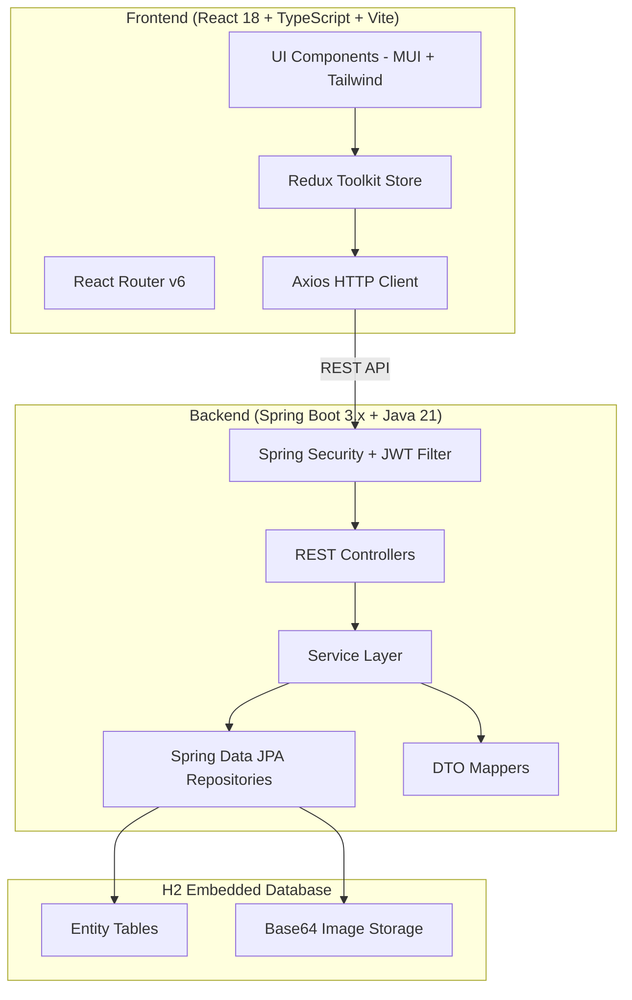
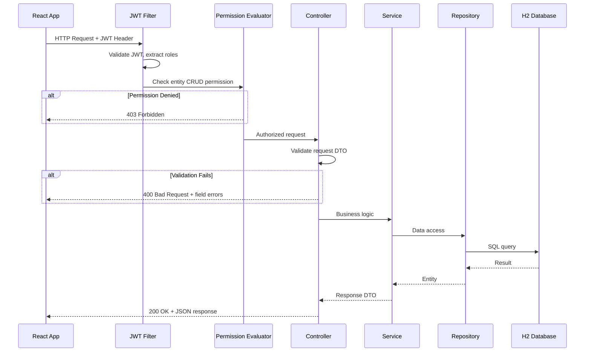
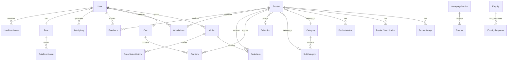
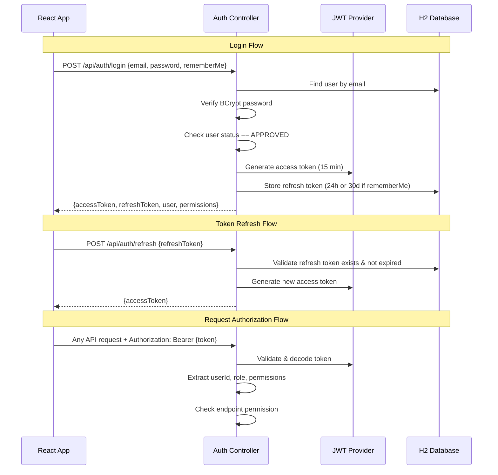
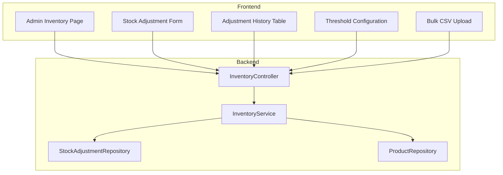

# Design Document: Glyde Curtains E-Commerce Platform

## Overview

This design describes the Phase 1 architecture for Glyde Curtains — an enterprise-grade e-commerce platform for curtains, blinds, and accessories. The system is a monolithic full-stack application with a Spring Boot backend serving REST APIs and an H2 embedded database, paired with a React TypeScript SPA frontend.

**Key Design Decisions:**
- **Monolithic deployment**: Single Spring Boot JAR containing backend + H2 database; React SPA served separately via Vite dev server (development) or built and served statically (production)
- **H2 embedded database**: All data including Base64-encoded images stored in-process; no external dependencies
- **Server-side cart**: Cart state lives exclusively in the database, frontend Redux acts as read-through cache
- **Layered architecture**: Controller → Service → Repository with DTOs and Mappers for clean separation
- **JWT stateless auth**: Access tokens (short-lived) + Refresh tokens (stored in DB) with role/permission claims
- **Permission matrix**: Granular CRUD per entity per role, resolved at request time via Spring Security filters

## Architecture

### High-Level System Architecture



### Backend Package Structure

```
com.glydecurtains
├── config/                  # App config, CORS, WebMvc, DataSeeder
├── security/
│   ├── JwtTokenProvider.java
│   ├── JwtAuthenticationFilter.java
│   ├── PermissionEvaluator.java
│   ├── SecurityConfig.java
│   └── RateLimitFilter.java
├── controller/
│   ├── AuthController.java
│   ├── UserController.java
│   ├── ProductController.java
│   ├── CategoryController.java
│   ├── OrderController.java
│   ├── CartController.java
│   ├── EmployeeController.java
│   ├── CmsController.java
│   ├── DashboardController.java
│   ├── StoreController.java
│   ├── FeedbackController.java
│   ├── AchievementController.java
│   ├── EnquiryController.java
│   ├── WishlistController.java
│   ├── ThemeController.java
│   ├── PermissionController.java
│   └── ImageController.java
├── service/
│   └── (matching service interfaces + impls)
├── repository/
│   └── (JPA repository interfaces)
├── entity/
│   └── (JPA entity classes)
├── dto/
│   ├── request/             # Incoming request DTOs
│   └── response/            # Outgoing response DTOs
├── mapper/
│   └── (Entity ↔ DTO mappers)
├── exception/
│   ├── GlobalExceptionHandler.java
│   ├── BusinessException.java
│   └── (custom exception classes)
├── validation/
│   └── (custom validators)
└── util/
    ├── ImageCompressor.java
    └── SlugGenerator.java
```

### Frontend Project Structure

```
src/
├── main.tsx
├── App.tsx
├── routes/
│   ├── AppRoutes.tsx
│   ├── ProtectedRoute.tsx
│   └── AdminRoute.tsx
├── store/
│   ├── store.ts
│   ├── slices/
│   │   ├── authSlice.ts
│   │   ├── cartSlice.ts
│   │   ├── productSlice.ts
│   │   ├── orderSlice.ts
│   │   ├── wishlistSlice.ts
│   │   ├── cmsSlice.ts
│   │   ├── themeSlice.ts
│   │   ├── uiSlice.ts
│   │   ├── searchSlice.ts
│   │   ├── employeeSlice.ts
│   │   ├── dashboardSlice.ts
│   │   ├── storeLocatorSlice.ts
│   │   ├── feedbackSlice.ts
│   │   ├── achievementSlice.ts
│   │   ├── enquirySlice.ts
│   │   └── permissionSlice.ts
│   └── hooks.ts
├── api/
│   ├── axiosInstance.ts      # Base config, interceptors, refresh logic
│   └── endpoints/            # Per-domain API functions
├── components/
│   ├── layout/               # Header, Footer, Sidebar, MegaMenu
│   ├── common/               # Buttons, Cards, Modals, Toast, Skeleton
│   ├── product/              # ProductCard, QuickView, ImageGallery
│   ├── cart/                 # CartDrawer, CartItem, CartSummary
│   ├── admin/                # Admin-specific components
│   └── cms/                  # CMS section renderers
├── pages/
│   ├── public/               # Home, ProductList, ProductDetail, StoreLocator
│   ├── auth/                 # Login, Register, ForgotPassword, ResetPassword
│   ├── customer/             # Profile, Orders, Wishlist, Cart, Feedback
│   └── admin/                # Dashboard, Products, Orders, Users, CMS, etc.
├── hooks/                    # Custom React hooks
├── utils/                    # Helpers, formatters, validators
├── types/                    # TypeScript interfaces/types
└── theme/
    ├── ThemeProvider.tsx
    ├── presets/              # 5+ theme preset configs
    └── globalStyles.ts
```

### Request Flow



## Components and Interfaces

### Backend Service Interfaces

#### AuthService
```java
public interface AuthService {
    AuthResponse login(LoginRequest request);
    AuthResponse register(RegisterRequest request);
    AuthResponse refreshToken(RefreshTokenRequest request);
    void logout(String refreshToken);
    void requestPasswordReset(String email);
    void resetPassword(ResetPasswordRequest request);
}
```

#### UserService
```java
public interface UserService {
    PageResponse<UserResponse> getUsers(UserFilterRequest filter, Pageable pageable);
    UserResponse approveUser(Long userId);
    UserResponse rejectUser(Long userId);
    UserResponse suspendUser(Long userId);
    UserResponse activateUser(Long userId);
    UserResponse changeRole(Long userId, RoleChangeRequest request);
    void resetUserPassword(Long userId);
}
```

#### PermissionService
```java
public interface PermissionService {
    PermissionMatrixResponse getPermissionMatrix();
    PermissionMatrixResponse updateRolePermissions(Long roleId, List<PermissionUpdateRequest> permissions);
    PermissionMatrixResponse updateUserPermissions(Long userId, List<PermissionUpdateRequest> permissions);
    UserPermissionResponse getUserPermissions(Long userId);
    CurrentUserPermissionResponse getMyPermissions();
}
```

#### ProductService
```java
public interface ProductService {
    ProductResponse createProduct(ProductCreateRequest request);
    ProductResponse updateProduct(Long id, ProductUpdateRequest request);
    void deleteProduct(Long id);
    ProductResponse archiveProduct(Long id);
    ProductResponse activateProduct(Long id);
    ProductResponse deactivateProduct(Long id);
    ProductDetailResponse getProduct(Long id);
    PageResponse<ProductResponse> getProducts(ProductFilterRequest filter, Pageable pageable);
    List<ProductResponse> getRelatedProducts(Long productId);
    List<ProductResponse> getSimilarProducts(Long productId);
    void updateSpecifications(Long productId, List<SpecificationRequest> specs);
    void updateVariantPricing(Long productId, List<VariantPriceRequest> variants);
}
```

#### CategoryService
```java
public interface CategoryService {
    CategoryResponse createCategory(CategoryCreateRequest request);
    CategoryResponse updateCategory(Long id, CategoryUpdateRequest request);
    void deleteCategory(Long id);
    List<CategoryTreeResponse> getCategoryTree();
    CategoryResponse updateSortOrder(Long id, int sortOrder);
    CategoryResponse toggleVisibility(Long id, boolean visible);
    CollectionResponse createCollection(CollectionCreateRequest request);
    CollectionResponse updateCollection(Long id, CollectionUpdateRequest request);
    List<CollectionResponse> getCollections();
}
```

#### CartService
```java
public interface CartService {
    CartResponse getCart();
    CartResponse addItem(CartItemRequest request);
    CartResponse updateItemQuantity(Long cartItemId, int quantity);
    CartResponse removeItem(Long cartItemId);
    void clearCart();
}
```

#### OrderService
```java
public interface OrderService {
    OrderResponse placeOrder(OrderPlaceRequest request);
    OrderResponse updateStatus(Long orderId, OrderStatusUpdateRequest request);
    OrderResponse cancelOrder(Long orderId);
    OrderDetailResponse getOrder(Long orderId);
    PageResponse<OrderResponse> getMyOrders(Pageable pageable);
    PageResponse<OrderResponse> getAllOrders(OrderFilterRequest filter, Pageable pageable);
    OrderResponse assignEmployee(Long orderId, Long employeeId);
}
```

#### SearchService
```java
public interface SearchService {
    PageResponse<ProductResponse> search(SearchRequest request, Pageable pageable);
    List<String> autocomplete(String query);
    List<String> getRecentSearches();
    void clearRecentSearches();
}
```

#### CmsService
```java
public interface CmsService {
    // Homepage sections
    List<HomepageSectionResponse> getHomepageSections();
    HomepageSectionResponse updateSection(Long id, SectionUpdateRequest request);
    void reorderSections(List<SectionOrderRequest> orders);
    // Banners
    BannerResponse createBanner(BannerCreateRequest request);
    BannerResponse updateBanner(Long id, BannerUpdateRequest request);
    void deleteBanner(Long id);
    // Site settings
    SiteSettingsResponse getSiteSettings();
    SiteSettingsResponse updateSiteSettings(SiteSettingsUpdateRequest request);
    // Static pages
    StaticPageResponse createPage(StaticPageCreateRequest request);
    StaticPageResponse updatePage(Long id, StaticPageUpdateRequest request);
    StaticPageResponse getPageBySlug(String slug);
    List<StaticPageResponse> getAllPages();
}
```

#### EmployeeService
```java
public interface EmployeeService {
    EmployeeResponse createEmployee(EmployeeCreateRequest request);
    EmployeeResponse updateEmployee(Long id, EmployeeUpdateRequest request);
    EmployeeResponse suspendEmployee(Long id);
    EmployeeResponse activateEmployee(Long id);
    void deleteEmployee(Long id);
    PageResponse<EmployeeResponse> getEmployees(EmployeeFilterRequest filter, Pageable pageable);
    void assignDepartment(Long employeeId, Long departmentId);
    void assignTask(Long employeeId, TaskAssignRequest request);
}
```

#### DashboardService
```java
public interface DashboardService {
    DashboardSummaryResponse getSummary();
    List<ActivityResponse> getRecentActivity(int limit);
    ChartDataResponse getOrderTrends(String period);
    ChartDataResponse getRevenueTrends(String period);
    ChartDataResponse getUserTrends(String period);
    List<ProductResponse> getLowStockProducts(int threshold);
    ReportResponse getSalesReport(ReportFilterRequest filter);
    ReportResponse getUserActivityReport(ReportFilterRequest filter);
    ReportResponse getInventoryReport();
}
```

#### StoreService
```java
public interface StoreService {
    StoreResponse createStore(StoreCreateRequest request);
    StoreResponse updateStore(Long id, StoreUpdateRequest request);
    void deleteStore(Long id);
    PageResponse<StoreResponse> getAllStores(Pageable pageable);
    List<StoreResponse> searchStores(String query);
}
```

#### FeedbackService
```java
public interface FeedbackService {
    FeedbackResponse submitFeedback(FeedbackCreateRequest request);
    FeedbackResponse approveFeedback(Long id);
    FeedbackResponse rejectFeedback(Long id);
    FeedbackResponse respondToFeedback(Long id, FeedbackReplyRequest request);
    PageResponse<FeedbackResponse> getFeedback(FeedbackFilterRequest filter, Pageable pageable);
    List<FeedbackResponse> getProductFeedback(Long productId);
    Double getProductAverageRating(Long productId);
}
```

#### AchievementService
```java
public interface AchievementService {
    AchievementResponse createAchievement(AchievementCreateRequest request);
    AchievementResponse updateAchievement(Long id, AchievementUpdateRequest request);
    void deleteAchievement(Long id);
    List<AchievementResponse> getActiveAchievements();
    void updateDisplayOrder(List<AchievementOrderRequest> orders);
    AchievementResponse toggleVisibility(Long id, boolean enabled);
}
```

#### EnquiryService
```java
public interface EnquiryService {
    EnquiryResponse submitEnquiry(EnquiryCreateRequest request);
    EnquiryResponse updateStatus(Long id, EnquiryStatusUpdateRequest request);
    EnquiryResponse respondToEnquiry(Long id, EnquiryReplyRequest request);
    PageResponse<EnquiryResponse> getEnquiries(EnquiryFilterRequest filter, Pageable pageable);
    EnquiryDetailResponse getEnquiry(Long id);
}
```

#### WishlistService
```java
public interface WishlistService {
    WishlistResponse addToWishlist(Long productId);
    void removeFromWishlist(Long productId);
    WishlistResponse getWishlist();
    CartResponse moveToCart(Long wishlistItemId);
    int getWishlistCount();
}
```

#### ImageService
```java
public interface ImageService {
    ImageResponse uploadImage(MultipartFile file, String entityType, Long entityId);
    ImageDataResponse getImage(Long imageId);
    void deleteImage(Long imageId);
}
```

### Frontend Key Component Interfaces

#### Axios Instance Configuration
- Base URL configuration
- Request interceptor: attach JWT access token from Redux store
- Response interceptor: on 401, attempt token refresh via `/api/auth/refresh`; on success retry original request; on failure redirect to login
- Global error handling with toast notifications

#### Redux Store Structure
```typescript
interface RootState {
  auth: AuthState;          // user, tokens, permissions, isAuthenticated
  cart: CartState;          // items, totals, loading
  products: ProductState;   // list, filters, pagination, currentProduct
  orders: OrderState;       // list, currentOrder, filters
  wishlist: WishlistState;  // items, count
  search: SearchState;      // query, suggestions, recentSearches
  cms: CmsState;            // sections, banners, settings, pages
  theme: ThemeState;        // activePreset, customOverrides
  ui: UIState;              // loading, toasts, modals, sidebarOpen
  employees: EmployeeState; // list, filters, departments
  dashboard: DashboardState; // summary, charts, reports
  storeLocator: StoreState; // stores, searchResults
  feedback: FeedbackState;  // list, productFeedback
  achievements: AchievementState; // list, displayOrder
  enquiries: EnquiryState;  // list, currentEnquiry
  permissions: PermissionState; // matrix, userPermissions
}
```

## Data Models

### Core Entity Relationship Diagram



### Entity Definitions

#### User
| Field | Type | Constraints |
|-------|------|-------------|
| id | Long | PK, auto-generated |
| name | String | Not null, max 100 |
| email | String | Not null, unique |
| password | String | BCrypt hashed |
| role | Enum(SUPER_ADMIN, ADMIN, EMPLOYEE, CUSTOMER) | Not null |
| status | Enum(PENDING, APPROVED, REJECTED, SUSPENDED, DEACTIVATED) | Not null |
| rememberMe | Boolean | Default false |
| createdAt | LocalDateTime | Auto-set |
| updatedAt | LocalDateTime | Auto-updated |

#### RefreshToken
| Field | Type | Constraints |
|-------|------|-------------|
| id | Long | PK |
| token | String | Unique, not null |
| userId | Long | FK → User |
| expiryDate | LocalDateTime | Not null |
| createdAt | LocalDateTime | Auto-set |

#### PasswordResetToken
| Field | Type | Constraints |
|-------|------|-------------|
| id | Long | PK |
| token | String | Unique |
| userId | Long | FK → User |
| expiryDate | LocalDateTime | 15 min from creation |
| used | Boolean | Default false |

#### Role & Permission Entities
| Entity | Fields |
|--------|--------|
| Role | id, name (SUPER_ADMIN, ADMIN, EMPLOYEE, CUSTOMER) |
| Permission | id, entity (products, categories, orders, etc.), operation (CREATE, READ, UPDATE, DELETE) |
| RolePermission | id, roleId (FK), permissionId (FK), granted (Boolean) |
| UserPermission | id, userId (FK), permissionId (FK), granted (Boolean) — overrides role-level |

#### Product
| Field | Type | Constraints |
|-------|------|-------------|
| id | Long | PK |
| name | String | Not null, max 200 |
| sku | String | Unique, not null |
| barcode | String | Optional |
| shortDescription | String | Max 500 |
| longDescription | Text | Optional |
| categoryId | Long | FK → Category |
| subCategoryId | Long | FK → SubCategory, optional |
| collectionId | Long | FK → Collection, optional |
| brand | String | Optional |
| material | String | Optional |
| pattern | String | Optional |
| colors | String (JSON array) | Multiple colors |
| sizes | String (JSON array) | Multiple sizes |
| length | Double | Optional |
| width | Double | Optional |
| height | Double | Optional |
| weight | Double | Optional |
| stockQuantity | Integer | Not null, >= 0 |
| basePrice | BigDecimal | Not null |
| discountPercentage | BigDecimal | Default 0 |
| offerPrice | BigDecimal | Calculated |
| status | Enum(ACTIVE, ARCHIVED, DEACTIVATED) | Not null |
| isFeatured | Boolean | Default false |
| isTrending | Boolean | Default false |
| isNewArrival | Boolean | Default false |
| isBestSeller | Boolean | Default false |
| isPremium | Boolean | Default false |
| tags | String (JSON array) | Optional |
| metaTitle | String | Optional SEO |
| metaDescription | String | Optional SEO |
| metaKeywords | String | Optional SEO |
| createdAt | LocalDateTime | Auto-set |
| updatedAt | LocalDateTime | Auto-updated |

#### ProductImage
| Field | Type | Constraints |
|-------|------|-------------|
| id | Long | PK |
| productId | Long | FK → Product |
| base64Data | Text (CLOB) | Not null |
| mimeType | String | Not null |
| originalFilename | String | Not null |
| width | Integer | Optional |
| height | Integer | Optional |
| isThumbnail | Boolean | Default false |
| sortOrder | Integer | Default 0 |
| uploadedAt | LocalDateTime | Auto-set |

#### ProductSpecification
| Field | Type | Constraints |
|-------|------|-------------|
| id | Long | PK |
| productId | Long | FK → Product |
| specKey | String | Not null (e.g., "Material") |
| specValue | String | Not null (e.g., "Aluminium") |
| sortOrder | Integer | Default 0 |

#### ProductVariant
| Field | Type | Constraints |
|-------|------|-------------|
| id | Long | PK |
| productId | Long | FK → Product |
| material | String | Optional |
| size | String | Optional |
| color | String | Optional |
| price | BigDecimal | Not null |
| stockQuantity | Integer | Default 0 |

#### Category & SubCategory
| Field | Type | Constraints |
|-------|------|-------------|
| Category: id | Long | PK |
| Category: name | String | Not null, unique |
| Category: description | String | Optional |
| Category: iconBase64 | Text | Optional |
| Category: imageBase64 | Text | Optional |
| Category: sortOrder | Integer | Default 0 |
| Category: isVisible | Boolean | Default true |
| Category: isActive | Boolean | Default true |
| SubCategory: id | Long | PK |
| SubCategory: name | String | Not null |
| SubCategory: categoryId | Long | FK → Category |
| SubCategory: sortOrder | Integer | Default 0 |
| SubCategory: isActive | Boolean | Default true |

#### Collection
| Field | Type | Constraints |
|-------|------|-------------|
| id | Long | PK |
| name | String | Not null |
| description | String | Optional |
| imageBase64 | Text | Optional |
| isActive | Boolean | Default true |
| createdAt | LocalDateTime | Auto-set |

#### Cart & CartItem
| Field | Type | Constraints |
|-------|------|-------------|
| Cart: id | Long | PK |
| Cart: userId | Long | FK → User, unique |
| Cart: updatedAt | LocalDateTime | Auto-updated |
| CartItem: id | Long | PK |
| CartItem: cartId | Long | FK → Cart |
| CartItem: productId | Long | FK → Product |
| CartItem: variantId | Long | FK → ProductVariant, optional |
| CartItem: quantity | Integer | Min 1 |
| CartItem: unitPrice | BigDecimal | Snapshot at add time |
| CartItem: addedAt | LocalDateTime | Auto-set |

#### Order & OrderItem
| Field | Type | Constraints |
|-------|------|-------------|
| Order: id | Long | PK |
| Order: orderNumber | String | Unique, auto-generated (e.g., GC-20240101-0001) |
| Order: userId | Long | FK → User |
| Order: status | Enum(PENDING, CONFIRMED, PACKED, DISPATCHED, DELIVERED, CANCELLED) | Not null |
| Order: subtotal | BigDecimal | Calculated |
| Order: grandTotal | BigDecimal | Calculated |
| Order: assignedEmployeeId | Long | FK → User, optional |
| Order: createdAt | LocalDateTime | Auto-set |
| Order: updatedAt | LocalDateTime | Auto-updated |
| OrderItem: id | Long | PK |
| OrderItem: orderId | Long | FK → Order |
| OrderItem: productId | Long | FK → Product |
| OrderItem: variantId | Long | FK → ProductVariant, optional |
| OrderItem: productName | String | Snapshot |
| OrderItem: quantity | Integer | Min 1 |
| OrderItem: unitPrice | BigDecimal | Snapshot at order time |
| OrderItem: subtotal | BigDecimal | quantity × unitPrice |

#### OrderStatusHistory
| Field | Type | Constraints |
|-------|------|-------------|
| id | Long | PK |
| orderId | Long | FK → Order |
| fromStatus | String | Previous status |
| toStatus | String | New status |
| changedBy | Long | FK → User (Admin/Employee) |
| changedAt | LocalDateTime | Auto-set |
| notes | String | Optional |

#### WishlistItem
| Field | Type | Constraints |
|-------|------|-------------|
| id | Long | PK |
| userId | Long | FK → User |
| productId | Long | FK → Product |
| addedAt | LocalDateTime | Auto-set |
| Unique constraint on (userId, productId) |

#### Employee (extends User with additional fields)
| Field | Type | Constraints |
|-------|------|-------------|
| id | Long | PK, FK → User |
| departmentId | Long | FK → Department, optional |
| permissions | Set<Permission> | Many-to-many |
| hireDate | LocalDate | Optional |

#### Department
| Field | Type | Constraints |
|-------|------|-------------|
| id | Long | PK |
| name | String | Not null |
| description | String | Optional |

#### Task
| Field | Type | Constraints |
|-------|------|-------------|
| id | Long | PK |
| title | String | Not null |
| description | String | Optional |
| assignedToId | Long | FK → User (Employee) |
| assignedById | Long | FK → User (Admin) |
| status | Enum(ASSIGNED, IN_PROGRESS, COMPLETED) | Default ASSIGNED |
| createdAt | LocalDateTime | Auto-set |

#### CMS Entities

**HomepageSection**
| Field | Type | Constraints |
|-------|------|-------------|
| id | Long | PK |
| sectionType | Enum(HERO_BANNER, PROMO_BANNER, FEATURED, LATEST, NEW_ARRIVALS, POPULAR_CATEGORIES, PREMIUM_COLLECTIONS, SEASONAL, BEST_SELLING, RECOMMENDED, FEATURED_ACCESSORIES, TRENDING, RECENTLY_ADDED, TESTIMONIALS, BRAND_STORY, ACHIEVEMENTS, NEWSLETTER, FOOTER, SCROLLING_TICKER) | Not null |
| title | String | Optional |
| isEnabled | Boolean | Default true |
| sortOrder | Integer | Not null |
| config | Text (JSON) | Section-specific configuration |

**Banner**
| Field | Type | Constraints |
|-------|------|-------------|
| id | Long | PK |
| sectionId | Long | FK → HomepageSection |
| title | String | Optional |
| subtitle | String | Optional |
| imageBase64 | Text | Not null |
| buttonText | String | Optional |
| buttonLink | String | Optional |
| sortOrder | Integer | Default 0 |
| isActive | Boolean | Default true |

**SiteSettings** (single row)
| Field | Type | Constraints |
|-------|------|-------------|
| id | Long | PK (always 1) |
| logoHeaderBase64 | Text | Optional |
| logoFooterBase64 | Text | Optional |
| logoMobileBase64 | Text | Optional |
| logoAdminBase64 | Text | Optional |
| faviconBase64 | Text | Optional |
| contactEmail | String | Optional |
| contactPhone | String | Optional |
| address | String | Optional |
| socialLinks | Text (JSON) | Optional |
| announcementBar | String | Optional |
| activeThemeId | Long | FK → ThemePreset |

**StaticPage**
| Field | Type | Constraints |
|-------|------|-------------|
| id | Long | PK |
| title | String | Not null |
| slug | String | Unique, not null |
| content | Text | Rich HTML content |
| pageType | Enum(ABOUT_US, CONTACT_US, TERMS, PRIVACY_POLICY, CUSTOM) | Not null |
| isVisible | Boolean | Default true |
| versionTimestamp | LocalDateTime | Updated on each edit |
| createdAt | LocalDateTime | Auto-set |
| updatedAt | LocalDateTime | Auto-updated |

**ThemePreset**
| Field | Type | Constraints |
|-------|------|-------------|
| id | Long | PK |
| name | String | Not null (e.g., "Dark Premium") |
| config | Text (JSON) | Full theme configuration |
| isDefault | Boolean | Default false |
| isActive | Boolean | Whether currently applied |

Theme config JSON structure:
```json
{
  "primaryColor": "#...",
  "secondaryColor": "#...",
  "accentColor": "#...",
  "backgroundColor": "#...",
  "textColor": "#...",
  "borderRadius": "8px",
  "shadowIntensity": "medium",
  "glassmorphismOpacity": 0.15,
  "animationSpeed": "normal"
}
```

#### Store Locator
| Field | Type | Constraints |
|-------|------|-------------|
| StoreLocation: id | Long | PK |
| StoreLocation: name | String | Not null |
| StoreLocation: address | String | Not null |
| StoreLocation: city | String | Not null |
| StoreLocation: state | String | Not null |
| StoreLocation: phone | String | Not null, validated format |
| StoreLocation: email | String | Optional, validated format |
| StoreLocation: latitude | Double | Optional (placeholder) |
| StoreLocation: longitude | Double | Optional (placeholder) |
| StoreLocation: operatingHours | Text (JSON) | Optional |
| StoreLocation: imageBase64 | Text | Optional |
| StoreLocation: isActive | Boolean | Default true |

#### Feedback
| Field | Type | Constraints |
|-------|------|-------------|
| id | Long | PK |
| userId | Long | FK → User |
| productId | Long | FK → Product, optional |
| rating | Integer | 1-5, not null |
| title | String | Not null |
| comment | Text | Not null |
| status | Enum(PENDING_REVIEW, APPROVED, REJECTED) | Default PENDING |
| adminReply | Text | Optional |
| repliedById | Long | FK → User, optional |
| createdAt | LocalDateTime | Auto-set |
| updatedAt | LocalDateTime | Auto-updated |

#### Achievement
| Field | Type | Constraints |
|-------|------|-------------|
| id | Long | PK |
| title | String | Not null |
| description | String | Optional |
| iconBase64 | Text | Optional |
| year | Integer | Optional |
| metricValue | String | e.g., "10000+" |
| metricFormat | Enum(NUMERIC_SUFFIX, PLAIN_TEXT, PERCENTAGE) | Default NUMERIC_SUFFIX |
| sortOrder | Integer | Default 0 |
| isEnabled | Boolean | Default true |

#### Enquiry
| Field | Type | Constraints |
|-------|------|-------------|
| id | Long | PK |
| name | String | Not null |
| email | String | Not null, valid format |
| phone | String | Optional |
| subject | String | Not null |
| message | Text | Not null |
| status | Enum(NEW, IN_PROGRESS, RESOLVED, CLOSED) | Default NEW |
| createdAt | LocalDateTime | Auto-set |
| updatedAt | LocalDateTime | Auto-updated |

#### EnquiryResponse
| Field | Type | Constraints |
|-------|------|-------------|
| id | Long | PK |
| enquiryId | Long | FK → Enquiry |
| responderId | Long | FK → User (Admin) |
| message | Text | Not null |
| createdAt | LocalDateTime | Auto-set |

#### ActivityLog
| Field | Type | Constraints |
|-------|------|-------------|
| id | Long | PK |
| userId | Long | FK → User, optional (for system events) |
| actionType | String | Not null (LOGIN, LOGOUT, CREATE, UPDATE, DELETE, STATUS_CHANGE, etc.) |
| entityType | String | What was acted on (USER, PRODUCT, ORDER, etc.) |
| entityId | Long | Optional |
| details | Text (JSON) | Action-specific details |
| ipAddress | String | Optional |
| timestamp | LocalDateTime | Auto-set |

### API Design

#### Standard Response Envelope

```json
// Success Response
{
  "status": "success",
  "message": "Product created successfully",
  "data": { ... },
  "timestamp": "2024-01-15T10:30:00Z"
}

// Error Response
{
  "status": "error",
  "errorCode": "VALIDATION_ERROR",
  "message": "Validation failed",
  "fieldErrors": [
    { "field": "email", "message": "Invalid email format" }
  ],
  "timestamp": "2024-01-15T10:30:00Z"
}

// Paginated Response
{
  "status": "success",
  "message": "Products retrieved",
  "data": {
    "content": [...],
    "pageNumber": 0,
    "pageSize": 20,
    "totalElements": 150,
    "totalPages": 8
  },
  "timestamp": "2024-01-15T10:30:00Z"
}
```

#### REST API Endpoints

**Authentication** (`/api/auth`)
| Method | Endpoint | Auth | Description |
|--------|----------|------|-------------|
| POST | /register | None | Register new customer |
| POST | /login | None | Login, returns JWT + refresh |
| POST | /refresh | None | Refresh access token |
| POST | /logout | JWT | Invalidate refresh token |
| POST | /forgot-password | None | Request password reset |
| POST | /reset-password | None | Reset password with token |

**Users** (`/api/users`)
| Method | Endpoint | Auth | Description |
|--------|----------|------|-------------|
| GET | / | Admin | List users (paginated, filterable) |
| GET | /{id} | Admin | Get user details |
| PUT | /{id}/approve | Admin | Approve pending user |
| PUT | /{id}/reject | Admin | Reject pending user |
| PUT | /{id}/suspend | Admin | Suspend user |
| PUT | /{id}/activate | Admin | Reactivate user |
| PUT | /{id}/role | Admin | Change user role |
| POST | /{id}/reset-password | Admin | Force password reset |
| GET | /me | JWT | Get current user profile |
| PUT | /me | JWT | Update own profile |

**Permissions** (`/api/permissions`)
| Method | Endpoint | Auth | Description |
|--------|----------|------|-------------|
| GET | /matrix | Admin | Get full permission matrix |
| PUT | /roles/{roleId} | Admin | Update role permissions |
| PUT | /users/{userId} | Admin | Update user permission overrides |
| GET | /users/{userId} | Admin | Get user's effective permissions |
| GET | /me | JWT | Get my permissions |

**Products** (`/api/products`)
| Method | Endpoint | Auth | Description |
|--------|----------|------|-------------|
| GET | / | Public | List products (paginated, filterable) |
| GET | /{id} | Public | Get product detail |
| POST | / | Admin/Employee | Create product |
| PUT | /{id} | Admin/Employee | Update product |
| DELETE | /{id} | Admin | Delete product |
| PUT | /{id}/archive | Admin | Archive product |
| PUT | /{id}/activate | Admin | Activate product |
| PUT | /{id}/deactivate | Admin | Deactivate product |
| PUT | /{id}/specifications | Admin/Employee | Update specifications |
| PUT | /{id}/variants | Admin/Employee | Update variant pricing |
| GET | /{id}/related | Public | Get related products |
| GET | /{id}/similar | Public | Get similar products |

**Categories** (`/api/categories`)
| Method | Endpoint | Auth | Description |
|--------|----------|------|-------------|
| GET | / | Public | Get category tree |
| POST | / | Admin | Create category |
| PUT | /{id} | Admin | Update category |
| DELETE | /{id} | Admin | Delete category (if unused) |
| POST | /sub-categories | Admin | Create sub-category |
| PUT | /sub-categories/{id} | Admin | Update sub-category |
| GET | /collections | Public | List collections |
| POST | /collections | Admin | Create collection |
| PUT | /collections/{id} | Admin | Update collection |

**Search** (`/api/search`)
| Method | Endpoint | Auth | Description |
|--------|----------|------|-------------|
| GET | /products | Public | Search products with filters |
| GET | /autocomplete | Public | Autocomplete suggestions |
| GET | /recent | JWT | Get recent searches |
| DELETE | /recent | JWT | Clear recent searches |

**Cart** (`/api/cart`)
| Method | Endpoint | Auth | Description |
|--------|----------|------|-------------|
| GET | / | Customer | Get cart contents |
| POST | /items | Customer | Add item to cart |
| PUT | /items/{id} | Customer | Update item quantity |
| DELETE | /items/{id} | Customer | Remove item from cart |
| DELETE | / | Customer | Clear cart |

**Orders** (`/api/orders`)
| Method | Endpoint | Auth | Description |
|--------|----------|------|-------------|
| POST | / | Customer | Place order |
| GET | /my | Customer | Get my orders |
| GET | /my/{id} | Customer | Get my order detail |
| PUT | /my/{id}/cancel | Customer | Cancel my order |
| GET | / | Admin/Employee | List all orders (paginated) |
| GET | /{id} | Admin/Employee | Get order detail |
| PUT | /{id}/status | Admin/Employee | Update order status |
| PUT | /{id}/assign | Admin | Assign employee to order |

**Employees** (`/api/employees`)
| Method | Endpoint | Auth | Description |
|--------|----------|------|-------------|
| GET | / | Admin | List employees |
| POST | / | Admin | Create employee |
| PUT | /{id} | Admin | Update employee |
| PUT | /{id}/suspend | Admin | Suspend employee |
| PUT | /{id}/activate | Admin | Activate employee |
| DELETE | /{id} | Admin | Delete (deactivate) employee |
| PUT | /{id}/department | Admin | Assign department |
| POST | /{id}/tasks | Admin | Assign task |
| GET | /{id}/tasks | Admin/Employee | Get employee tasks |

**CMS** (`/api/cms`)
| Method | Endpoint | Auth | Description |
|--------|----------|------|-------------|
| GET | /homepage | Public | Get enabled homepage sections |
| GET | /homepage/all | Admin | Get all sections (including disabled) |
| PUT | /homepage/sections/{id} | Admin | Update section |
| PUT | /homepage/reorder | Admin | Reorder sections |
| POST | /banners | Admin | Create banner |
| PUT | /banners/{id} | Admin | Update banner |
| DELETE | /banners/{id} | Admin | Delete banner |
| GET | /settings | Public | Get site settings |
| PUT | /settings | Admin | Update site settings |
| GET | /pages | Public | List visible static pages |
| GET | /pages/{slug} | Public | Get page by slug |
| POST | /pages | Admin | Create static page |
| PUT | /pages/{id} | Admin | Update static page |
| GET | /themes | Public | Get active theme |
| GET | /themes/all | Admin | List all themes |
| PUT | /themes/{id}/activate | Admin | Activate theme |
| PUT | /themes/{id} | Admin | Update theme config |
| GET | /themes/{id}/preview | Admin | Preview theme |

**Wishlist** (`/api/wishlist`)
| Method | Endpoint | Auth | Description |
|--------|----------|------|-------------|
| GET | / | Customer | Get wishlist |
| POST | /{productId} | Customer | Add to wishlist |
| DELETE | /{productId} | Customer | Remove from wishlist |
| POST | /{itemId}/move-to-cart | Customer | Move to cart |
| GET | /count | Customer | Get wishlist count |

**Stores** (`/api/stores`)
| Method | Endpoint | Auth | Description |
|--------|----------|------|-------------|
| GET | / | Public | List active stores |
| GET | /search | Public | Search stores by city/area |
| POST | / | Admin | Create store |
| PUT | /{id} | Admin | Update store |
| DELETE | /{id} | Admin | Delete store |
| GET | /admin | Admin | List all stores (paginated) |

**Feedback** (`/api/feedback`)
| Method | Endpoint | Auth | Description |
|--------|----------|------|-------------|
| POST | / | Customer | Submit feedback |
| GET | /products/{productId} | Public | Get approved product feedback |
| GET | /products/{productId}/rating | Public | Get average rating |
| GET | / | Admin | List all feedback (paginated) |
| PUT | /{id}/approve | Admin | Approve feedback |
| PUT | /{id}/reject | Admin | Reject feedback |
| POST | /{id}/reply | Admin | Reply to feedback |

**Achievements** (`/api/achievements`)
| Method | Endpoint | Auth | Description |
|--------|----------|------|-------------|
| GET | / | Public | Get active achievements |
| POST | / | Admin | Create achievement |
| PUT | /{id} | Admin | Update achievement |
| DELETE | /{id} | Admin | Delete achievement |
| PUT | /reorder | Admin | Update display order |
| PUT | /{id}/toggle | Admin | Enable/disable achievement |

**Enquiries** (`/api/enquiries`)
| Method | Endpoint | Auth | Description |
|--------|----------|------|-------------|
| POST | / | Public | Submit enquiry (Contact Us form) |
| GET | / | Admin | List enquiries (paginated, filterable) |
| GET | /{id} | Admin | Get enquiry detail |
| PUT | /{id}/status | Admin | Update enquiry status |
| POST | /{id}/reply | Admin | Reply to enquiry |

**Dashboard** (`/api/dashboard`)
| Method | Endpoint | Auth | Description |
|--------|----------|------|-------------|
| GET | /summary | Admin | Get summary cards |
| GET | /activity | Admin | Get recent activity |
| GET | /charts/orders | Admin | Order trend chart data |
| GET | /charts/revenue | Admin | Revenue trend chart data |
| GET | /charts/users | Admin | User trend chart data |
| GET | /low-stock | Admin | Low stock products |
| GET | /reports/sales | Admin | Sales report |
| GET | /reports/users | Admin | User activity report |
| GET | /reports/inventory | Admin | Inventory report |

**Images** (`/api/images`)
| Method | Endpoint | Auth | Description |
|--------|----------|------|-------------|
| POST | /upload | Admin | Upload and encode image |
| GET | /{id} | Public | Get image data |
| DELETE | /{id} | Admin | Delete image |

**Activity Logs** (`/api/activity-logs`)
| Method | Endpoint | Auth | Description |
|--------|----------|------|-------------|
| GET | / | Admin | Get activity logs (paginated, filterable) |

### Security Design

#### Authentication Flow



#### JWT Token Structure
```json
{
  "sub": "user@email.com",
  "userId": 1,
  "role": "ADMIN",
  "iat": 1705312200,
  "exp": 1705313100
}
```

- Access token TTL: 15 minutes
- Refresh token TTL: 24 hours (standard) / 30 days (remember me)
- Algorithm: HS256 with application-configured secret

#### Permission Resolution Logic

The permission system uses a three-tier resolution:

1. **Super Admin bypass**: If role == SUPER_ADMIN → always ALLOW
2. **User-level override**: Check `UserPermission` table for (userId, entity, operation). If found, use its `granted` value.
3. **Role-level default**: Check `RolePermission` table for (roleId, entity, operation). Use its `granted` value.
4. **Implicit deny**: If no permission record exists → DENY

```java
// Pseudo-code for permission resolution
boolean hasPermission(User user, String entity, CrudOperation op) {
    if (user.getRole() == Role.SUPER_ADMIN) return true;
    
    // Check user-specific override first
    Optional<UserPermission> userPerm = userPermissionRepo
        .findByUserIdAndEntityAndOperation(user.getId(), entity, op);
    if (userPerm.isPresent()) return userPerm.get().isGranted();
    
    // Fall back to role-level permission
    Optional<RolePermission> rolePerm = rolePermissionRepo
        .findByRoleIdAndEntityAndOperation(user.getRole().getId(), entity, op);
    if (rolePerm.isPresent()) return rolePerm.get().isGranted();
    
    return false; // implicit deny
}
```

#### Rate Limiting

- Authentication endpoints (`/api/auth/login`, `/api/auth/forgot-password`): Max 5 attempts per 15 minutes per IP
- Implemented via in-memory `ConcurrentHashMap<String, List<Instant>>` in `RateLimitFilter`
- Returns HTTP 429 Too Many Requests when exceeded

#### Security Headers (applied via Spring Security)

```
X-Content-Type-Options: nosniff
X-Frame-Options: DENY
X-XSS-Protection: 1; mode=block
Strict-Transport-Security: max-age=31536000; includeSubDomains
Content-Security-Policy: default-src 'self'; img-src 'self' data:; style-src 'self' 'unsafe-inline'
```

#### CSRF Protection
- Enabled for all state-changing endpoints (POST, PUT, DELETE)
- Token delivered via `XSRF-TOKEN` cookie
- Frontend includes `X-XSRF-TOKEN` header on all mutating requests
- Stateless CSRF using double-submit cookie pattern

#### Input Sanitization
- All String inputs sanitized through a custom `@Sanitize` annotation + AOP aspect
- HTML entities escaped using OWASP Java HTML Sanitizer for rich text fields
- SQL injection prevention via Spring Data JPA parameterized queries (inherent)

### State Management Design (Frontend)

#### Auth Slice
```typescript
interface AuthState {
  user: UserProfile | null;
  accessToken: string | null;
  refreshToken: string | null;
  permissions: PermissionSet;
  isAuthenticated: boolean;
  isLoading: boolean;
  error: string | null;
}
```
- On login success: store tokens in localStorage, populate user/permissions in Redux
- On logout: clear Redux state, clear localStorage, redirect to login
- On 401: attempt refresh; if fails, trigger logout flow

#### Cart Slice
```typescript
interface CartState {
  items: CartItem[];
  subtotal: number;
  grandTotal: number;
  itemCount: number;
  isLoading: boolean;
  error: string | null;
}
```
- Every cart operation dispatches async thunk → calls backend API → updates Redux from response
- Redux cart is a read-through cache; backend is the source of truth
- On login: fetch cart from backend to hydrate Redux state

#### Theme Slice
```typescript
interface ThemeState {
  activePreset: ThemePreset;
  customOverrides: Partial<ThemeConfig>;
  mode: 'dark' | 'light';
  availablePresets: ThemePreset[];
}
```
- Theme preference persisted in localStorage
- Active theme fetched from `/api/cms/themes` on app init
- CSS variables injected via ThemeProvider wrapping MUI ThemeProvider + Tailwind config

#### Data Flow Pattern
All slices follow the same pattern:
1. Component dispatches async thunk
2. Thunk calls API endpoint via axios
3. On success: update slice state with response data
4. On failure: set error in slice, trigger toast notification
5. Components subscribe to relevant slice via `useSelector`


## Internationalization (i18n) Design

### Overview

The platform supports three languages: English (en), Hindi (hi), and Gujarati (gu). English is the default language. The i18n system covers UI labels, backend messages, and CMS content.

### Frontend i18n Architecture

**Library**: `react-i18next` with `i18next` core

```
src/
├── i18n/
│   ├── index.ts              # i18next initialization and config
│   ├── locales/
│   │   ├── en/
│   │   │   ├── common.json   # Shared labels (nav, buttons, errors)
│   │   │   ├── auth.json     # Login, register, forgot password
│   │   │   ├── products.json # Product-related labels
│   │   │   ├── cart.json     # Cart and checkout labels
│   │   │   ├── orders.json   # Order-related labels
│   │   │   ├── admin.json    # Admin panel labels
│   │   │   └── validation.json # Form validation messages
│   │   ├── hi/
│   │   │   └── (same structure as en/)
│   │   └── gu/
│   │       └── (same structure as en/)
│   └── LanguageSwitcher.tsx  # Language selector component
```

**Configuration**:
```typescript
import i18n from 'i18next';
import { initReactI18next } from 'react-i18next';

i18n.use(initReactI18next).init({
  fallbackLng: 'en',
  supportedLngs: ['en', 'hi', 'gu'],
  defaultNS: 'common',
  interpolation: { escapeValue: false },
  detection: {
    order: ['localStorage', 'navigator'],
    caches: ['localStorage'],
  },
});
```

**Language Switcher**: Placed in the navigation bar, allows users to switch languages instantly. For authenticated users, the selection is persisted to their profile via API call.

**Usage Pattern**:
```typescript
const { t } = useTranslation('products');
// t('product.addToCart') → "Add to Cart" | "कार्ट में जोड़ें" | "કાર્ટમાં ઉમેરો"
```

### Backend i18n Architecture

**Message Source**: Spring's `MessageSource` with property files.

```
src/main/resources/
├── messages.properties        # English (default)
├── messages_hi.properties     # Hindi
└── messages_gu.properties     # Gujarati
```

**Language Resolution**: The backend reads the `Accept-Language` header or `lang` query parameter to determine response language for validation errors and system messages.

```java
@Configuration
public class LocaleConfig implements WebMvcConfigurer {
    @Bean
    public LocaleResolver localeResolver() {
        AcceptHeaderLocaleResolver resolver = new AcceptHeaderLocaleResolver();
        resolver.setDefaultLocale(Locale.ENGLISH);
        resolver.setSupportedLocales(List.of(
            Locale.ENGLISH, Locale.forLanguageTag("hi"), Locale.forLanguageTag("gu")
        ));
        return resolver;
    }
}
```

### CMS Multi-Language Content

**Entity Extension**: CMS entities (products, static pages, banners, categories) support multi-language content via a `TranslatedContent` table:

| Field | Type | Constraints |
|-------|------|-------------|
| id | Long | PK |
| entityType | String | Not null (PRODUCT, BANNER, PAGE, CATEGORY) |
| entityId | Long | Not null |
| fieldName | String | Not null (name, description, shortDescription, etc.) |
| language | String | Not null (en, hi, gu) |
| content | Text | Not null |

**Resolution Logic**:
1. Frontend sends `Accept-Language: hi` header
2. Backend queries `TranslatedContent` for the requested entity + language
3. If translation found → return translated field
4. If not found → fall back to English (default entity field)

### User Language Preference

**User Entity Extension**:
| Field | Type | Constraints |
|-------|------|-------------|
| preferredLanguage | String | Default "en", one of: en, hi, gu |

- Set during registration (optional dropdown)
- Updateable from profile settings
- Returned in login response so frontend can initialize i18n with the user's preference
- For unauthenticated visitors, language preference is stored in localStorage

### Search Multi-Language Support

The `Search_Service` searches across all language variants:
- Product name search queries both the base `product.name` field AND `TranslatedContent` entries for the product's name field
- Filter labels and sort options are translated client-side via i18n resource files
- Category names in filters use the translated version based on active language

### Admin CMS Language Interface

When Admin manages content (products, banners, pages):
- The CMS form shows language tabs (EN | HI | GU)
- Each tab allows entering content in that language
- English is required; Hindi and Gujarati are optional
- If a translation is not provided, the English version is used as fallback


## File and Media Picker Design

### Frontend Media Upload Component

```
src/components/common/
├── MediaPicker/
│   ├── MediaPicker.tsx        # Main picker component (file input + drag-and-drop)
│   ├── MediaPreview.tsx       # Preview thumbnail for images/videos
│   ├── MediaGallery.tsx       # Gallery grid of uploaded media with reorder/delete
│   ├── DropZone.tsx           # Drag-and-drop zone with visual highlight
│   ├── UploadProgress.tsx     # Upload progress indicator
│   └── mediaValidation.ts    # Client-side format/size/duration validators
```

**MediaPicker Props Interface**:
```typescript
interface MediaPickerProps {
  accept: 'image' | 'video' | 'both';          // Filter file types
  multiple?: boolean;                            // Allow multi-select
  maxFileSize?: number;                          // Max bytes (default 5MB images, 10MB videos)
  maxDuration?: number;                          // Max video seconds (default 10)
  onUpload: (files: UploadedMedia[]) => void;   // Callback with Base64 results
  existingMedia?: MediaItem[];                   // Already-uploaded items for gallery display
  onReorder?: (order: number[]) => void;         // Reorder callback
  onDelete?: (mediaId: number) => void;          // Delete callback
}
```

**Supported Formats**:
- Images: JPEG, PNG, WebP, SVG (max 5MB per file)
- Videos: MP4, WebM (max 10MB per file, max 10 seconds duration)

**Client-Side Validation Flow**:
1. User selects file via picker or drops onto DropZone
2. Validate format (MIME type check)
3. Validate size (file.size check)
4. For videos: load into HTMLVideoElement, check `video.duration <= 10`
5. If valid → show preview; if invalid → show inline error with violated constraint
6. On confirm → encode to Base64 → POST to backend

**Video Duration Validation (Client-Side)**:
```typescript
async function validateVideoDuration(file: File, maxSeconds: number): Promise<boolean> {
  return new Promise((resolve) => {
    const video = document.createElement('video');
    video.preload = 'metadata';
    video.onloadedmetadata = () => {
      URL.revokeObjectURL(video.src);
      resolve(video.duration <= maxSeconds);
    };
    video.src = URL.createObjectURL(file);
  });
}
```

### Backend Video Upload Extension

**ImageService Extension** (renamed conceptually to MediaService):
```java
public interface ImageService {
    // Existing image methods...
    ImageResponse uploadImage(MultipartFile file, String entityType, Long entityId);
    ImageResponse uploadVideo(MultipartFile file, String entityType, Long entityId);
    ImageDataResponse getImage(Long imageId);
    void deleteImage(Long imageId);
}
```

**Video Validation (Server-Side)**:
- Format: MP4, WebM (validated via MIME type and file header magic bytes)
- Size: Maximum 10MB before compression
- Duration: Extract via a lightweight Java media library or FFmpeg wrapper; reject if > 10 seconds
- Storage: Encoded as Base64 in the same `ProductImage` table with a `mediaType` discriminator (IMAGE vs VIDEO)

**ProductImage Entity Extension**:
| Field | Type | Constraints |
|-------|------|-------------|
| mediaType | Enum(IMAGE, VIDEO) | Default IMAGE |
| duration | Integer | Seconds, nullable (videos only) |

## Default Super Admin Credentials Design

### Database Seeding (Updated)

The `DataSeeder` component creates ONLY the Super Admin account on first run:

```java
@Component
public class DataSeeder implements CommandLineRunner {
    @Override
    public void run(String... args) {
        if (userRepository.count() == 0) {
            User superAdmin = User.builder()
                .name("Super Admin")
                .email("admin@glydecurtains.com")
                .password(passwordEncoder.encode("admin123"))  // BCrypt hashed
                .role(UserRole.SUPER_ADMIN)
                .status(UserStatus.APPROVED)
                .preferredLanguage("en")
                .build();
            userRepository.save(superAdmin);
            
            // Seed categories, products, CMS config, themes, etc.
            // Do NOT seed other user accounts — Super Admin creates them
        }
    }
}
```

**Key Points**:
- Only ONE default account: Super Admin (admin@glydecurtains.com / admin123)
- Password "admin123" is an exception to normal strength rules for initial seed only
- All other accounts (Admin, Employee, Customer) are created by the Super Admin post-login
- When Super Admin creates employees: sets initial password, account created as APPROVED with assigned role
- First-login notification: Frontend checks if user has never changed password (a `passwordChangedAt` field is null) and displays a prominent banner recommending password change

**User Entity Extension**:
| Field | Type | Constraints |
|-------|------|-------------|
| passwordChangedAt | LocalDateTime | Nullable, set on password change |

**Employee Account Creation Flow**:
1. Super Admin/Admin navigates to Employee Management → Add Employee
2. Fills: name, email, initial password, department, permissions
3. Backend creates account with status APPROVED, role EMPLOYEE (or specified role)
4. Employee can log in immediately with provided credentials
5. Employee changes password from profile settings (recommended on first login)


## Bundled Logo Design

### Logo Asset Location

```
frontend/
├── public/
│   └── assets/
│       └── logo/
│           └── logo.jpg     # Bundled default logo (copied from project root logo/logo.jpg)
```

The logo is imported as a static asset and used as the default across all placements. CMS-uploaded logos override the bundled logo when present.

**Logo Resolution Logic (Frontend)**:
```typescript
function getLogoUrl(placement: 'header' | 'footer' | 'mobile' | 'admin' | 'login'): string {
  const siteSettings = useAppSelector(state => state.cms.siteSettings);
  
  // Check CMS override for specific placement
  const customLogo = {
    header: siteSettings?.logoHeaderBase64,
    footer: siteSettings?.logoFooterBase64,
    mobile: siteSettings?.logoMobileBase64,
    admin: siteSettings?.logoAdminBase64,
    login: siteSettings?.logoHeaderBase64, // login uses header logo
  }[placement];
  
  if (customLogo) return `data:image/jpeg;base64,${customLogo}`;
  
  // Fallback to bundled logo
  return '/assets/logo/logo.jpg';
}
```

**Logo Sizing Per Placement**:
| Placement | Desktop Height | Mobile Height | Style Notes |
|-----------|---------------|---------------|-------------|
| Header nav | 48-56px | 32-40px | Auto width, subtle shadow on dark bg |
| Footer | 36-44px | 32px | Slightly reduced opacity (0.9) |
| Login page | 80-120px | 60-80px | Centered, prominent |
| Admin sidebar | 36-44px | N/A | Fits sidebar width |
| Invoice header | 60px | N/A | Left-aligned, printed resolution |

## Invoice Generation Design

### Backend Architecture

**New Service**: `InvoiceService`

```java
public interface InvoiceService {
    byte[] generateInvoice(Long orderId);
    InvoiceResponse getInvoice(Long orderId);
    List<byte[]> bulkGenerateInvoices(List<Long> orderIds);
    InvoiceSettingsResponse getInvoiceSettings();
    InvoiceSettingsResponse updateInvoiceSettings(InvoiceSettingsUpdateRequest request);
}
```

**Invoice Generation Library**: OpenPDF (open-source fork of iText) or Thymeleaf HTML → PDF via Flying Saucer (xhtmlrenderer)

Recommended approach: **Thymeleaf HTML template → PDF** via Flying Saucer
- Create `invoice-template.html` Thymeleaf template
- Render template with order data, company info, logo
- Convert rendered HTML to PDF using Flying Saucer + OpenPDF

### New Entities

**InvoiceSettings** (single row, Admin-configurable):
| Field | Type | Constraints |
|-------|------|-------------|
| id | Long | PK (always 1) |
| companyName | String | Default "Glyde Curtains" |
| companyAddress | String | Optional |
| companyPhone | String | Optional |
| companyEmail | String | Optional |
| taxRegistrationNumber | String | Optional |
| footerText | String | Optional (e.g., "Thank you for your business") |
| termsText | Text | Optional |
| numberFormat | String | Default "INV-{YYYYMMDD}-{NNNN}" |
| includeLogoOnInvoice | Boolean | Default true |
| enableCustomerDownload | Boolean | Default true |
| nextSequenceNumber | Integer | Auto-increment per day |

**GeneratedInvoice** (cached PDF storage):
| Field | Type | Constraints |
|-------|------|-------------|
| id | Long | PK |
| orderId | Long | FK → Order, unique |
| invoiceNumber | String | Unique, auto-generated |
| pdfBase64 | Text (CLOB) | Generated PDF as Base64 |
| generatedAt | LocalDateTime | Auto-set |
| generatedBy | Long | FK → User (Admin who generated) |

### API Endpoints

**Invoices** (`/api/invoices`):
| Method | Endpoint | Auth | Description |
|--------|----------|------|-------------|
| POST | /orders/{orderId}/generate | Admin/Employee (Create permission) | Generate invoice for order |
| GET | /orders/{orderId} | Customer/Admin (Read permission) | Download invoice PDF |
| POST | /bulk-generate | Admin (Create permission) | Bulk generate for multiple orders |
| GET | /settings | Admin | Get invoice settings |
| PUT | /settings | Admin | Update invoice settings |

### Invoice Template (Thymeleaf)

```
src/main/resources/templates/
└── invoice-template.html    # A4-sized invoice with logo, company info, line items, totals
```

**Template Layout**:
```
┌────────────────────────────────────────┐
│ [Logo]       INVOICE                   │
│ Company Name        Invoice #: INV-... │
│ Company Address     Date: YYYY-MM-DD   │
│ Phone / Email       Order #: GC-...    │
├────────────────────────────────────────┤
│ Bill To:                               │
│ Customer Name                          │
│ Customer Email                         │
├────────────────────────────────────────┤
│ # │ Product │ Variant │ Qty │ Price │ Total │
│ 1 │ ...     │ ...     │ ... │ ...   │ ...   │
│ 2 │ ...     │ ...     │ ... │ ...   │ ...   │
├────────────────────────────────────────┤
│                          Grand Total: ₹XXXX │
├────────────────────────────────────────┤
│ Terms & Conditions:                    │
│ [Admin-configured text]                │
├────────────────────────────────────────┤
│ [Footer text]                          │
└────────────────────────────────────────┘
```

### Frontend Integration

- **Customer Order Detail Page**: Show "Download Invoice" button only if:
  - `invoiceSettings.enableCustomerDownload == true`
  - Order status is CONFIRMED or later (not PENDING or CANCELLED)
  - User has "Read" permission on "invoices" entity
- **Admin Order Detail Page**: Show "Generate Invoice" button
- **Admin Order List Page**: Bulk action checkbox + "Generate Invoices" button for selected orders
- **Admin Settings**: Invoice Settings page under CMS section

### Permission Entity Extension

Add "invoices" to the list of managed entities in the Permission_Matrix:
- Create: Generate new invoices
- Read: Download/view invoices
- Update: Modify invoice settings
- Delete: (reserved, invoices are immutable once generated)


## Dockerized Deployment and CI/CD Design

### Project Root Structure (DevOps Files)

```
glydecurtains/
├── backend/
│   ├── Dockerfile
│   ├── pom.xml
│   └── src/
├── frontend/
│   ├── Dockerfile
│   ├── nginx/
│   │   └── default.conf        # Nginx config for SPA routing + security headers
│   ├── package.json
│   └── src/
├── docker-compose.yml           # Development/INT orchestration
├── docker-compose.prod.yml      # Production overrides
├── .env.example                 # Environment variable template
├── .github/
│   └── workflows/
│       └── ci.yml               # GitHub Actions CI/CD pipeline
├── Makefile                     # Common development commands
├── README.md                    # Project documentation
├── CHANGELOG.md                 # Release notes (Keep a Changelog format)
├── VERSION                      # Semantic version (1.0.0)
├── .gitignore
└── logo/
    └── logo.jpg                 # Bundled brand logo
```

### Backend Dockerfile (Multi-Stage)

```dockerfile
# Stage 1: Build
FROM maven:3.9-eclipse-temurin-21 AS build
WORKDIR /app
COPY pom.xml .
RUN mvn dependency:go-offline -B
COPY src ./src
RUN mvn package -DskipTests -B

# Stage 2: Runtime
FROM eclipse-temurin:21-jre-alpine
WORKDIR /app
COPY --from=build /app/target/*.jar app.jar
EXPOSE 8080
HEALTHCHECK --interval=30s --timeout=3s CMD wget -qO- http://localhost:8080/api/health || exit 1
ENTRYPOINT ["java", "-jar", "app.jar"]
```

### Frontend Dockerfile (Multi-Stage)

```dockerfile
# Stage 1: Build
FROM node:20-alpine AS build
WORKDIR /app
COPY package*.json ./
RUN npm ci
COPY . .
RUN npm run build

# Stage 2: Serve
FROM nginx:alpine
COPY --from=build /app/dist /usr/share/nginx/html
COPY nginx/default.conf /etc/nginx/conf.d/default.conf
EXPOSE 80
HEALTHCHECK --interval=30s --timeout=3s CMD wget -qO- http://localhost:80/ || exit 1
```

### Nginx Configuration (Frontend)

```nginx
server {
    listen 80;
    server_name glydecurtains.com www.glydecurtains.com;
    root /usr/share/nginx/html;
    index index.html;

    # SPA routing fallback
    location / {
        try_files $uri $uri/ /index.html;
    }

    # API proxy to backend
    location /api/ {
        proxy_pass http://backend:8080/api/;
        proxy_set_header Host $host;
        proxy_set_header X-Real-IP $remote_addr;
        proxy_set_header X-Forwarded-For $proxy_add_x_forwarded_for;
        proxy_set_header X-Forwarded-Proto $scheme;
    }

    # Gzip compression
    gzip on;
    gzip_types text/plain application/json application/javascript text/css image/svg+xml;
    gzip_min_length 1024;

    # Cache static assets
    location ~* \.(js|css|png|jpg|jpeg|gif|ico|svg|woff2?)$ {
        expires 30d;
        add_header Cache-Control "public, immutable";
    }

    # Security headers
    add_header X-Frame-Options "DENY" always;
    add_header X-Content-Type-Options "nosniff" always;
    add_header X-XSS-Protection "1; mode=block" always;
    add_header Referrer-Policy "strict-origin-when-cross-origin" always;
}
```

### docker-compose.yml

```yaml
version: '3.8'

services:
  backend:
    build: ./backend
    ports:
      - "8080:8080"
    environment:
      - SPRING_PROFILES_ACTIVE=${ENVIRONMENT:-int}
      - JWT_SECRET=${JWT_SECRET:-defaultDevSecret123456789012345678}
      - CORS_ORIGINS=${CORS_ORIGINS:-http://localhost:5173,http://localhost:3000}
    healthcheck:
      test: ["CMD", "wget", "-qO-", "http://localhost:8080/api/health"]
      interval: 30s
      timeout: 3s
      retries: 3

  frontend:
    build: ./frontend
    ports:
      - "80:80"
    depends_on:
      backend:
        condition: service_healthy

networks:
  default:
    name: glydecurtains-network
```

### Environment Profiles

**application-int.yml** (Integration/Development):
```yaml
spring:
  profiles: int
  h2:
    console:
      enabled: true
  jpa:
    show-sql: true
logging:
  level:
    com.glydecurtains: DEBUG
cors:
  allowed-origins: http://localhost:5173,http://localhost:3000
app:
  environment: INT
  seed-data: true
```

**application-qa.yml** (QA/Staging):
```yaml
spring:
  profiles: qa
  h2:
    console:
      enabled: false
  jpa:
    show-sql: false
logging:
  level:
    com.glydecurtains: INFO
cors:
  allowed-origins: https://qa.glydecurtains.com
app:
  environment: QA
  seed-data: true
```

**application-prod.yml** (Production):
```yaml
spring:
  profiles: prod
  h2:
    console:
      enabled: false
  jpa:
    show-sql: false
logging:
  level:
    com.glydecurtains: WARN
    root: INFO
cors:
  allowed-origins: https://glydecurtains.com,https://www.glydecurtains.com
server:
  servlet:
    session:
      cookie:
        domain: glydecurtains.com
        secure: true
        http-only: true
app:
  environment: PROD
  seed-data: false
  domain: glydecurtains.com
```

### CI/CD Pipeline (GitHub Actions)

```yaml
# .github/workflows/ci.yml
name: CI/CD Pipeline

on:
  push:
    branches: [main, develop, 'release/*']
  pull_request:
    branches: [main, develop]

jobs:
  build-test:
    runs-on: ubuntu-latest
    steps:
      - uses: actions/checkout@v4
      - name: Setup Java 21
        uses: actions/setup-java@v4
        with: { java-version: '21', distribution: 'temurin' }
      - name: Build & Test Backend
        run: cd backend && mvn verify -B
      - name: Setup Node 20
        uses: actions/setup-node@v4
        with: { node-version: '20' }
      - name: Build & Lint Frontend
        run: cd frontend && npm ci && npm run lint && npm run build

  docker-build:
    needs: build-test
    runs-on: ubuntu-latest
    steps:
      - uses: actions/checkout@v4
      - name: Build Docker Images
        run: |
          docker build -t glydecurtains-backend:${{ github.sha }} ./backend
          docker build -t glydecurtains-frontend:${{ github.sha }} ./frontend

  deploy-int:
    needs: docker-build
    if: github.ref == 'refs/heads/develop'
    runs-on: ubuntu-latest
    environment: integration
    steps:
      - run: echo "Deploy to INT environment"

  deploy-qa:
    needs: docker-build
    if: startsWith(github.ref, 'refs/heads/release/')
    runs-on: ubuntu-latest
    environment: qa
    steps:
      - run: echo "Deploy to QA environment"

  deploy-prod:
    needs: docker-build
    if: github.ref == 'refs/heads/main'
    runs-on: ubuntu-latest
    environment:
      name: production
      url: https://glydecurtains.com
    steps:
      - run: echo "Deploy to PROD environment"
```

### Git Branching Strategy

```
main ─────────────────────────── Production (glydecurtains.com)
  │
  └── release/1.0.0 ──────────── QA stabilization → merge to main
        │
        └── develop ───────────── Integration (continuous)
              │
              ├── feature/auth ── Feature branches
              ├── feature/cart
              └── feature/cms
```

### Health Endpoint

```java
@RestController
@RequestMapping("/api")
public class HealthController {
    @Value("${app.version:1.0.0}") private String version;
    @Value("${app.environment:unknown}") private String environment;
    
    @GetMapping("/health")
    public Map<String, Object> health() {
        return Map.of(
            "status", "UP",
            "version", version,
            "environment", environment,
            "timestamp", LocalDateTime.now()
        );
    }
}
```

## Report and Dashboard Permission Design

Reports and Dashboard are governed by the same Permission_Matrix as all other entities:

| Entity | Create | Read | Update | Delete |
|--------|--------|------|--------|--------|
| dashboard | — | View dashboard | — | — |
| reports | — | View/download reports | — | — |
| invoices | Generate | Download | Update settings | — |

- **Super Admin**: Always has full access (bypass)
- **Admin**: Granted Read on dashboard and reports by default
- **Employee**: Must be explicitly granted Read on dashboard/reports via Permission_Matrix
- **Customer**: Never has access to dashboard/reports

The Frontend hides navigation links and pages when the user's resolved permission set lacks "Read" on "dashboard" or "reports".


## Dedicated Inventory Management System Design (Requirement 46)

### Overview

A dedicated inventory management module that provides granular stock control beyond simple stock quantity fields on products. Enables stock adjustments with full audit trail, low-stock threshold alerts, bulk operations, and CSV import for warehouse workflows.

### Architecture



### New Entity: StockAdjustment

| Field | Type | Constraints |
|-------|------|-------------|
| id | Long | PK, auto-generated |
| productId | Long | FK → Product, not null |
| adjustmentType | Enum(ADD, REMOVE, SET) | Not null |
| quantity | Integer | Not null, positive for ADD/SET, positive for REMOVE (absolute value) |
| resultingStock | Integer | Not null, >= 0 (stock level after adjustment) |
| reason | String | Not null, max 500 |
| performedBy | Long | FK → User, not null |
| createdAt | LocalDateTime | Auto-set |

### Product Entity Extension

| Field | Type | Constraints |
|-------|------|-------------|
| lowStockThreshold | Integer | Default 5, >= 0 |

### Backend Service Interface

```java
public interface InventoryService {
    StockAdjustmentResponse adjustStock(StockAdjustmentRequest request);
    PageResponse<StockAdjustmentResponse> getAdjustmentHistory(Long productId, Pageable pageable);
    ProductResponse updateLowStockThreshold(Long productId, int threshold);
    List<StockAdjustmentResponse> bulkAdjustStock(List<StockAdjustmentRequest> requests);
    List<StockAdjustmentResponse> bulkAdjustFromCsv(MultipartFile csvFile);
}
```

### Implementation: InventoryServiceImpl

```java
@Service
@RequiredArgsConstructor
@Transactional
public class InventoryServiceImpl implements InventoryService {

    private final ProductRepository productRepository;
    private final StockAdjustmentRepository stockAdjustmentRepository;
    private final UserRepository userRepository;

    @Override
    public StockAdjustmentResponse adjustStock(StockAdjustmentRequest request) {
        Product product = productRepository.findById(request.getProductId())
                .orElseThrow(() -> new ResourceNotFoundException("Product not found"));

        int currentStock = product.getStockQuantity();
        int newStock = calculateNewStock(currentStock, request.getAdjustmentType(), request.getQuantity());

        if (newStock < 0) {
            throw new BusinessException("Insufficient stock. Current: " + currentStock);
        }

        product.setStockQuantity(newStock);
        productRepository.save(product);

        StockAdjustment adjustment = new StockAdjustment();
        adjustment.setProductId(request.getProductId());
        adjustment.setAdjustmentType(request.getAdjustmentType());
        adjustment.setQuantity(request.getQuantity());
        adjustment.setResultingStock(newStock);
        adjustment.setReason(request.getReason());
        adjustment.setPerformedBy(SecurityUtils.getCurrentUserId());

        return mapToResponse(stockAdjustmentRepository.save(adjustment));
    }

    private int calculateNewStock(int current, AdjustmentType type, int quantity) {
        return switch (type) {
            case ADD -> current + quantity;
            case REMOVE -> current - quantity;
            case SET -> quantity;
        };
    }
}
```

### InventoryController Endpoints

```java
@RestController
@RequestMapping("/api/inventory")
@RequiredArgsConstructor
public class InventoryController {

    private final InventoryService inventoryService;

    @PostMapping("/adjust")
    public ResponseEntity<ApiResponse<StockAdjustmentResponse>> adjustStock(
            @Valid @RequestBody StockAdjustmentRequest request) { ... }

    @GetMapping("/history/{productId}")
    public ResponseEntity<ApiResponse<PageResponse<StockAdjustmentResponse>>> getHistory(
            @PathVariable Long productId, Pageable pageable) { ... }

    @PutMapping("/threshold/{productId}")
    public ResponseEntity<ApiResponse<ProductResponse>> updateThreshold(
            @PathVariable Long productId,
            @RequestBody ThresholdUpdateRequest request) { ... }

    @PostMapping("/bulk-adjust")
    public ResponseEntity<ApiResponse<List<StockAdjustmentResponse>>> bulkAdjust(
            @Valid @RequestBody List<StockAdjustmentRequest> requests) { ... }

    @PostMapping("/bulk-csv")
    public ResponseEntity<ApiResponse<List<StockAdjustmentResponse>>> bulkCsvAdjust(
            @RequestParam("file") MultipartFile file) { ... }
}
```

### API Endpoints

**Inventory** (`/api/inventory`):
| Method | Endpoint | Auth | Description |
|--------|----------|------|-------------|
| POST | /adjust | Admin/Employee (inventory:CREATE) | Single stock adjustment |
| GET | /history/{productId} | Admin/Employee (inventory:READ) | Get adjustment history for product |
| PUT | /threshold/{productId} | Admin (inventory:UPDATE) | Update low-stock threshold |
| POST | /bulk-adjust | Admin (inventory:CREATE) | Bulk adjust multiple products |
| POST | /bulk-csv | Admin (inventory:CREATE) | Upload CSV for bulk adjustments |

### Request/Response DTOs

```java
public record StockAdjustmentRequest(
    @NotNull Long productId,
    @NotNull AdjustmentType adjustmentType,
    @NotNull @Min(1) Integer quantity,
    @NotBlank @Size(max = 500) String reason
) {}

public record ThresholdUpdateRequest(
    @NotNull @Min(0) Integer lowStockThreshold
) {}

public record StockAdjustmentResponse(
    Long id,
    Long productId,
    String productName,
    String productSku,
    AdjustmentType adjustmentType,
    Integer quantity,
    Integer resultingStock,
    String reason,
    String performedByName,
    LocalDateTime createdAt
) {}
```

### CSV Format for Bulk Import

```csv
productId,adjustmentType,quantity,reason
1,ADD,50,Warehouse restock - January shipment
2,REMOVE,5,Damaged items removed
3,SET,100,Physical count reconciliation
```

### Permission Entity Extension

Add `"inventory"` to the entities array in `DataSeeder.seedPermissions()`:

```java
String[] entities = {"products", "categories", "orders", "users", "employees",
        "feedback", "enquiries", "cms", "store_locations", "achievements",
        "permissions", "invoices", "dashboard", "reports", "inventory"};
```

### Frontend: Admin Inventory Management Page

**Location**: `src/pages/admin/InventoryManagement.tsx`

**Components**:
- `InventoryDashboard` — Overview showing low-stock alerts
- `StockAdjustmentForm` — Form with product selector (autocomplete), adjustment type radio buttons, quantity input, reason textarea
- `AdjustmentHistoryTable` — Paginated table showing all adjustments for a selected product
- `ThresholdConfigPanel` — Inline edit for per-product low-stock threshold
- `BulkCsvUpload` — Drag-and-drop CSV upload with preview and validation feedback

**Redux Slice**: `inventorySlice.ts`
```typescript
interface InventoryState {
  adjustmentHistory: StockAdjustment[];
  isLoading: boolean;
  error: string | null;
  bulkResults: StockAdjustment[];
}
```

**Navigation**: Add "Inventory" item to admin sidebar under the existing product management section. Visibility controlled by `inventory:READ` permission.

---

## Seed Demo Customer Account Design (Requirement 47)

### Overview

Add a pre-seeded customer account for demo/testing purposes. This allows immediate frontend testing of customer flows without manual registration.

### DataSeeder Update

Add a new method `seedDemoCustomer()` called from the `run()` method after `seedSuperAdmin()`:

```java
private void seedDemoCustomer() {
    User customer = new User();
    customer.setName("DK");
    customer.setEmail("dk@glydecurtains.com");
    customer.setPassword(passwordEncoder.encode("dk"));
    customer.setRole(UserRole.CUSTOMER);
    customer.setStatus(UserStatus.APPROVED);
    customer.setPasswordChangedAt(null);
    userRepository.save(customer);
    log.info("Demo customer account created (dk@glydecurtains.com).");
}
```

**Updated `run()` method**:
```java
@Override
@Transactional
public void run(String... args) {
    if (userRepository.count() > 0) {
        log.info("Database already seeded, skipping...");
        return;
    }
    log.info("Seeding database with initial data...");
    seedSuperAdmin();
    seedDemoCustomer();  // NEW
    seedCategories();
    seedProducts();
    seedPermissions();
    seedHomepageSections();
    seedStoreLocations();
    seedAchievements();
    seedInvoiceSettings();
    seedSiteSettings();
    log.info("Database seeding completed.");
}
```

**Credentials**:
| Field | Value |
|-------|-------|
| Name | DK |
| Email | dk@glydecurtains.com |
| Password | dk (BCrypt hashed at seed time) |
| Role | CUSTOMER |
| Status | APPROVED |

**Notes**:
- Password "dk" is intentionally simple — demo account for development/testing only
- Account is pre-approved so no admin action is required to start using it
- Customer can immediately log in, browse products, add to cart, and place orders

---

## Backend Unit Tests Design (Requirement 48)

### Overview

Comprehensive unit test suite covering all service layer classes using JUnit 5 with Mockito for dependency isolation. Tests verify business logic independently from the database and HTTP layers.

### Test Structure

```
backend/src/test/java/com/glydecurtains/service/
├── AuthServiceTest.java
├── UserServiceTest.java
├── ProductServiceTest.java
├── CategoryServiceTest.java
├── CartServiceTest.java
├── OrderServiceTest.java
├── SearchServiceTest.java
├── CmsServiceTest.java
├── EmployeeServiceTest.java
├── DashboardServiceTest.java
├── StoreServiceTest.java
├── FeedbackServiceTest.java
├── AchievementServiceTest.java
├── EnquiryServiceTest.java
├── WishlistServiceTest.java
├── ImageServiceTest.java
├── InvoiceServiceTest.java
├── PermissionServiceTest.java
└── InventoryServiceTest.java
```

### Test Setup Pattern

Each service test follows this standard pattern:

```java
@ExtendWith(MockitoExtension.class)
class ProductServiceTest {

    @Mock
    private ProductRepository productRepository;

    @Mock
    private CategoryRepository categoryRepository;

    @Mock
    private ProductImageRepository productImageRepository;

    @InjectMocks
    private ProductServiceImpl productService;

    private Product sampleProduct;
    private ProductCreateRequest createRequest;

    @BeforeEach
    void setUp() {
        sampleProduct = new Product();
        sampleProduct.setId(1L);
        sampleProduct.setName("Test Curtain");
        sampleProduct.setSku("TC-001");
        sampleProduct.setBasePrice(BigDecimal.valueOf(999.00));
        sampleProduct.setStockQuantity(50);
        sampleProduct.setStatus(ProductStatus.ACTIVE);

        createRequest = new ProductCreateRequest(
            "Test Curtain", "TC-001", null, 1L, null, null,
            null, null, null, null, null, null, null, null, null,
            BigDecimal.valueOf(999.00), BigDecimal.ZERO, 50,
            false, false, false, false, false, null, null, null, null
        );
    }
}
```

### Test Patterns Per Service

#### Pattern 1: Success Path Tests
```java
@Test
@DisplayName("Should create product successfully with valid request")
void createProduct_ValidRequest_ReturnsProductResponse() {
    // Arrange
    when(categoryRepository.existsById(1L)).thenReturn(true);
    when(productRepository.existsBySku("TC-001")).thenReturn(false);
    when(productRepository.save(any(Product.class))).thenReturn(sampleProduct);

    // Act
    ProductResponse result = productService.createProduct(createRequest);

    // Assert
    assertNotNull(result);
    assertEquals("Test Curtain", result.name());
    verify(productRepository).save(any(Product.class));
}
```

#### Pattern 2: Validation Failure Tests
```java
@Test
@DisplayName("Should throw exception when SKU already exists")
void createProduct_DuplicateSku_ThrowsException() {
    when(productRepository.existsBySku("TC-001")).thenReturn(true);

    assertThrows(BusinessException.class, () -> productService.createProduct(createRequest));
    verify(productRepository, never()).save(any());
}
```

#### Pattern 3: Edge Case Tests
```java
@Test
@DisplayName("Should handle empty product list for category")
void getProductsByCategory_NoProducts_ReturnsEmptyPage() {
    when(productRepository.findByCategoryId(eq(1L), any(Pageable.class)))
        .thenReturn(Page.empty());

    PageResponse<ProductResponse> result = productService.getProducts(
        new ProductFilterRequest(1L, null, null, null, null, null), PageRequest.of(0, 20));

    assertNotNull(result);
    assertEquals(0, result.totalElements());
    assertTrue(result.content().isEmpty());
}
```

#### Pattern 4: Exception Handling Tests
```java
@Test
@DisplayName("Should throw ResourceNotFoundException for non-existent product")
void getProduct_NonExistentId_ThrowsResourceNotFound() {
    when(productRepository.findById(999L)).thenReturn(Optional.empty());

    assertThrows(ResourceNotFoundException.class, () -> productService.getProduct(999L));
}
```

### Key Test Scenarios Per Service

| Service | Test Scenarios |
|---------|---------------|
| AuthService | Login success, login invalid password, login non-existent user, login non-approved user, register success, register duplicate email, token refresh, token expired |
| UserService | Get users paginated, approve user, reject user, suspend user, role change, change to same role (noop) |
| ProductService | Create/update/delete, archive/activate/deactivate, duplicate SKU, non-existent category, filter by various criteria |
| CategoryService | Create category, create with duplicate name, delete used category (should fail), reorder, toggle visibility |
| CartService | Add item, add duplicate item (increment qty), update quantity, remove item, clear cart, quantity exceeds max (10) |
| OrderService | Place order, place order empty cart, update status valid transition, update status invalid transition, cancel order |
| InventoryService | Adjust ADD/REMOVE/SET, remove exceeds stock (fail), bulk adjust, threshold update |
| WishlistService | Add to wishlist, add duplicate (idempotent), remove, move to cart |
| FeedbackService | Submit feedback, approve/reject, product average rating calculation |
| InvoiceService | Generate invoice, generate for non-existent order, bulk generate |

### Dependencies (pom.xml already includes)

```xml
<dependency>
    <groupId>org.springframework.boot</groupId>
    <artifactId>spring-boot-starter-test</artifactId>
    <scope>test</scope>
</dependency>
```

This provides: JUnit 5, Mockito, AssertJ, Spring Test utilities.

### Test Execution

```bash
# Run all unit tests
mvn test

# Run a specific service test
mvn test -Dtest=ProductServiceTest

# Run with coverage report (JaCoCo)
mvn verify
```

---

## Cart Quantity Limit Design (Requirement 49)

### Overview

Enforce a maximum quantity of 10 items per product in the cart. This prevents unreasonable quantities and protects stock allocation. The limit is validated both on the backend (authoritative) and the frontend (UX).

### Backend Changes

#### CartServiceImpl Constant

```java
@Service
@RequiredArgsConstructor
@Transactional
public class CartServiceImpl implements CartService {

    public static final int MAX_QUANTITY_PER_ITEM = 10;

    private final CartRepository cartRepository;
    private final CartItemRepository cartItemRepository;
    private final ProductRepository productRepository;

    @Override
    public CartResponse addItem(CartItemRequest request) {
        // Validate quantity limit
        if (request.quantity() > MAX_QUANTITY_PER_ITEM) {
            throw new BusinessException(
                "Maximum quantity per item is " + MAX_QUANTITY_PER_ITEM);
        }

        Cart cart = getOrCreateCart();
        Optional<CartItem> existingItem = cartItemRepository
            .findByCartIdAndProductIdAndVariantId(
                cart.getId(), request.productId(), request.variantId());

        if (existingItem.isPresent()) {
            int newQuantity = existingItem.get().getQuantity() + request.quantity();
            if (newQuantity > MAX_QUANTITY_PER_ITEM) {
                throw new BusinessException(
                    "Cannot add more. Maximum quantity per item is " + MAX_QUANTITY_PER_ITEM
                    + ". Current quantity in cart: " + existingItem.get().getQuantity());
            }
            existingItem.get().setQuantity(newQuantity);
            cartItemRepository.save(existingItem.get());
        } else {
            // Create new cart item...
        }

        return buildCartResponse(cart);
    }

    @Override
    public CartResponse updateItemQuantity(Long cartItemId, int quantity) {
        if (quantity < 1 || quantity > MAX_QUANTITY_PER_ITEM) {
            throw new BusinessException(
                "Quantity must be between 1 and " + MAX_QUANTITY_PER_ITEM);
        }

        CartItem item = cartItemRepository.findById(cartItemId)
            .orElseThrow(() -> new ResourceNotFoundException("Cart item not found"));

        item.setQuantity(quantity);
        cartItemRepository.save(item);

        return buildCartResponse(item.getCart());
    }
}
```

### Validation Points

| Operation | Validation |
|-----------|------------|
| Add to cart (new item) | `request.quantity <= 10` |
| Add to cart (existing item) | `existingQty + request.quantity <= 10` |
| Update quantity | `1 <= newQuantity <= 10` |

### Error Response

```json
{
  "status": "error",
  "errorCode": "CART_QUANTITY_LIMIT_EXCEEDED",
  "message": "Maximum quantity per item is 10. Current quantity in cart: 7",
  "timestamp": "2024-01-15T10:30:00Z"
}
```

### Frontend Changes

#### Quantity Selector Component

**Location**: `src/components/cart/QuantitySelector.tsx`

```typescript
interface QuantitySelectorProps {
  value: number;
  onChange: (quantity: number) => void;
  max?: number;  // defaults to MAX_QUANTITY_PER_ITEM (10)
  min?: number;  // defaults to 1
}

const MAX_QUANTITY_PER_ITEM = 10;

const QuantitySelector: React.FC<QuantitySelectorProps> = ({
  value,
  onChange,
  max = MAX_QUANTITY_PER_ITEM,
  min = 1
}) => {
  return (
    <Box display="flex" alignItems="center" gap={1}>
      <IconButton
        onClick={() => onChange(Math.max(min, value - 1))}
        disabled={value <= min}
        size="small"
      >
        <RemoveIcon />
      </IconButton>

      <TextField
        type="number"
        value={value}
        onChange={(e) => {
          const newVal = Math.min(max, Math.max(min, parseInt(e.target.value) || min));
          onChange(newVal);
        }}
        inputProps={{ min, max, style: { textAlign: 'center', width: '40px' } }}
        size="small"
      />

      <IconButton
        onClick={() => onChange(Math.min(max, value + 1))}
        disabled={value >= max}
        size="small"
      >
        <AddIcon />
      </IconButton>

      {value >= max && (
        <Typography variant="caption" color="error">
          Max {max} per item
        </Typography>
      )}
    </Box>
  );
};
```

#### Usage Points

The `QuantitySelector` component is used in:
1. **ProductDetail page** — "Add to Cart" section (quantity picker before adding)
2. **CartDrawer / CartPage** — Inline quantity editor for each cart item
3. **QuickView modal** — Quantity selector in product quick view

#### Error Handling (Frontend)

When the backend returns a 400 with `CART_QUANTITY_LIMIT_EXCEEDED`:
- Display a toast notification: "Maximum quantity per item is 10"
- Do NOT update the Redux cart state (keep previous valid state)
- The quantity selector's `disabled` state on the "+" button prevents most cases from reaching the backend

#### Cart Slice Update

```typescript
// In cartSlice.ts async thunks
export const addToCart = createAsyncThunk(
  'cart/addItem',
  async (request: CartItemRequest, { rejectWithValue }) => {
    try {
      const response = await cartApi.addItem(request);
      return response.data;
    } catch (error: any) {
      if (error.response?.data?.errorCode === 'CART_QUANTITY_LIMIT_EXCEEDED') {
        return rejectWithValue(error.response.data.message);
      }
      throw error;
    }
  }
);
```

### Constant Synchronization

- Backend: `CartServiceImpl.MAX_QUANTITY_PER_ITEM = 10`
- Frontend: `const MAX_QUANTITY_PER_ITEM = 10` in a shared constants file (`src/utils/constants.ts`)
- Both enforce the same limit. Frontend prevents most violations via UI constraints; backend is the authoritative guard.
